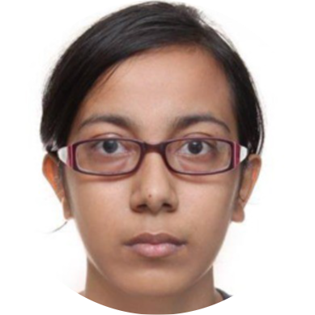

  

## 22CYS - Semester-wise Faculty Details

### 2021 - 2022: Semester 1 

| Cat | Code | Subject Title | Credit | Faculty | 
|:---:|:----:|:--------------|:------:|:-------:|
| HUM | 19ENG111 | Technical Communication | 3 | | 
| HUM | 19CUL101 | Cultural Education – 1 | 2 | |
| SCI | 19PHY101 | Engineering Physics | 3 | |
| MAT | 20MAT102 | Linear Algebra | 4 |    Dr. Chungath Srinivasan |
| ENGG | 20CYS101 | Classical Cryptography | 2 |    Mr. Saurabh Shrivastava |
| ENGG | 19CSE100 | Problem Solving and Algorithmic Thinking | 4 |    Dr. K.N. Ambili |
| ENGG | 20CYS102 | Principles of Engineering | 3 |    Amit Agarwal |
| ENGG | 20CYS103 | Computer Hardware and System Essentials | 3 |    Mr. Ashok Kumar Mohan |

### 2022-2023: Semester 2 

| Cat | Code | Subject Title | Credit | Faculty | 
|:---:|:----:|:--------------|:------:|:-------:|
| HUM | 19CUL111 | Cultural Education – II | 2 | | 
| MAT | 20MAT113 | Discrete Mathematics | 4 |    Dr. Chungath Srinivasan |
| MAT | 20MAT112 | Number Theory and Algebra | 3 |    Dr. K.V. Lakshmy |
| ENGG | 20CYS111 | Digital Signal Processing | 3 |    Amit Agarwal |
| ENGG | 20CYS112 | Computer Organisation and Architecture | 4 |     Dr. K.N. Ambili |
| ENGG | 20CYS113 | Computer Programming | 3 |    Mr. Ramaguru Radhakrishnan |
| ENGG | 20CYS181 | Computer Programming Lab | 1 |    Mr. Ramaguru Radhakrishnan |
| ENGG | 20CYS114 | Cyber Security Essentials | 3 |    Mr. Saurabh Shrivastava |

### 2022-2023: Semester 3 

| Cat | Code | Subject Title | Credit | Faculty | 
|:---:|:----:|:--------------|:------:|:-------:|
| HUM | 19AVP201 | Amrita Value Program I | 1 |  |
| MAT | 20CYS201 | Optimization Techniques | 4 |    Ms. Diya Bhattacharyya |
| CYS | 20CYS202 | User Interface Design | 2 |    Ms. Hemalatha P |
| CYS | 20CYS203 | Operating Systems | 3 |    Mr. Anand R Nair |
| CYS | 20CYS281 | Operating System Lab | 1 |    Mr. Anand R Nair |
| CSE | 19CSE201 | Advanced Programming | 3 |    Mr. Ramaguru Radhakrishnan |
| CYS | 20CYS204 | Database Management System | 3 |    Dr. K.N. Ambili |
| CYS | 20CYS205 | Modern Cryptography | 4 |    Prof. M. Sethumadhavan |

###  2023-2024: Semester 4 

| Cat | Code | Subject Title | Credit | Faculty | 
|:---:|:----:|:--------------|:------:|:-------:|
| HUM | 19AVP211 | Amrita Value Program II | 1 |  |
| HUM | 19SSK211 | Soft Skills – 1 | 2 | |
| MAT | 20CYS211 | Probability and Statistics | 4 | Ms. Sangeeta Kumari |
| CYS | 20CYS212 | Multimedia Processing | 3 |    Dr. Sujitha V |
| CYS | 20CYS213 | System Security | 3 |    Dr. Praveen K |
| CYS | 20CYS282 | System Security Lab | 1 |    Dr. Praveen K |
| CYS | 20CYS215 | Machine Learning in Cyber Security | 3 |    Dr. Amritha PP |
| CYS | 20CYS214 | Data Structures and Algorithms | 3 |    Mr. Anand R Nair |
| CYS | 20CYS283 | Data Structures and Algorithms Lab | 1 |    Mr. Anand R Nair |
| CYS | 20CYS383 | Java Programming Lab | 1 |    Mr. Ramaguru Radhakrishnan |

### 2023-2024: Semester 5 

| Cat | Code | Subject Title | Credit | Faculty | 
|:---:|:----:|:--------------|:------:|:-------:|
| CYS | 20CYS301 | Digital Communication | 3 |    Dr. Amit Agarwal |
| CYS | 20CYS302 | Secure Coding | 4 |    Ms. Jevitha K P |
| CYS | 20CYS305 | Algorithms: Design and Analysis  | 3 |    Mr. Sreejith K |
| CYS | 20CYS303 | Computer Networks | 3 |    Mr. Saurabh Shrivastava |
| CYS | 20CYS382 | Computer Networks Lab | 1 |    Mr. Saurabh Shrivastava |
| CYS | 20CYS304 | Artificial Intelligence and Neural Networks | 4 |    Ms. Hemalatha P |
| HUM | 19ENV300 | Environmental Science | P/F |    Mr. Ramaguru Radhakrishnan |
| HUM | 19SSK301 | Soft Skills – 2 | 2 |
| HUM | 19HUM240 | Pyschology for Engineers (Humanities Elective)  | 2 | Dr. Rajalakshmi S. A. | 
| HUM | 19ENG230 | Business Communication (Humanities Elective)  | 2 | Ms. Shobhana Kumaraguru |
| HUM | 23CMJ232 | Mobile Video Production (Humanities Elective)  | 2 |  |
| HUM |  | Film Appreciation (Humanities Elective)  | 2 |  |
| ENGG | 19LIV390 | Live – in – Labs | [3] |

### 2024-2025: Semester 6 

| Cat | Code | Subject Title | Credit | Faculty | 
|:---:|:----:|:--------------|:------:|:-------:|
| CYS | 20CYS311 | Cyber Forensics | 3 |    Mr. Saurabh Shrivastava |
| CYS | 20CYS312 | Principles of Programming Languages | 3 |    Dr. Jevitha K P |
| CYS | 20CYS384 | Advanced Protocol Engineering and Security Lab | 1 |    Mr. Anand R Nair |
| CYS | 20CYS313 | Network Security | 3 |    Mr. Akhil K J |
| CYS | 20CYS314 | Applied Cryptography | 4 |    Dr. K.V. Lakshmy |
| CYS | 20CYS315 | Automata Theory and Compiler Design | 3 |    Dr. K.N. Ambili |
| CYS | 24CYS333 | Internet of Things (Professional Elective – 1)  | 3 |    Mr. Ramaguru Radhakrishnan |
| HUM | 19SSK311 | Soft Skills – 3 | 2 |  |
| HUM | 19LAW300 | Indian Constitution | P/F |
| ENGG | 19LIV490 | Live – in – Labs | [3] |  |

### 2024-2025: Semester 7 

| Cat | Code | Subject Title | Credit | Faculty | 
|:---:|:----:|:--------------|:------:|:-------:|
| CYS | 20CYS401 | Secure Software Engineering | 3 |
| CYS | 20CYS402 | Distributed Systems and Cloud Computing | 3 |
| CYS | 20CYS403 | Web Application Security | 3 |
| CYS | 20CYS404 | Android Application Development | 1 |
| CYS |  | Professional Elective – 1  | 3 |
| CYS |  | Professional Elective – 2  | 3 |
| CYS |  | Free Elective - 1 | 3 |
| CYS | 20CYS495 | Project: Phase - 1 / Seminar | 2 |    Mr. Sreejith K |

### 2025-2026: Semester 8 

| Cat | Code | Subject Title | Credit | Faculty | 
|:---:|:----:|:--------------|:------:|:-------:|
| CYS | 20CYS499 | Project: Phase - 2 | 10 |    Mr. Sreejith K |
